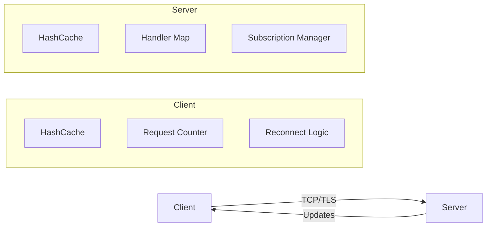
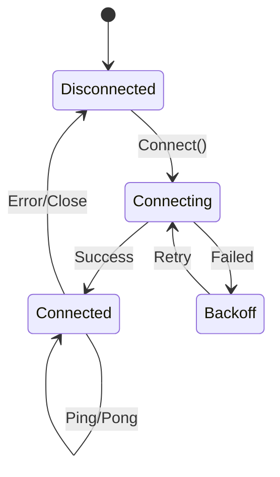

# NanoRPC Protocol Definition

## Abstract

NanoRPC is a lightweight binary RPC protocol designed specifically for
resource-constrained embedded systems operating in trusted environments. It
provides efficient remote procedure call capabilities with minimal overhead for
serial communications and local network connections. The protocol supports
request-response patterns, publish-subscribe messaging, and automatic
reconnection handling. It uses Protocol Buffers for serialisation and FNV-1a
hashing for efficient path identification. Gateway bridges can translate NanoRPC
to gRPC or HTTP/2 for internet connectivity.

## 1. Introduction

### 1.1 Purpose

NanoRPC addresses the need for efficient RPC communication in environments where
traditional solutions like gRPC are too resource-intensive. It is optimised for:

- **Serial communications**: Low-speed UART, RS-232, RS-485 connections.
- **Local networks**: Factory automation, vehicle buses, building control.
- **Resource constraints**: Microcontrollers with kilobytes of RAM.
- **Trusted environments**: No need for complex authentication or encryption.

Key design goals include:

- **Minimal memory footprint**: Optimised for embedded systems with limited RAM.
- **Efficient binary encoding**: Using Protocol Buffers with nanopb for C
  compatibility.
- **Hash-based path routing**: 32-bit FNV-1a hashes reduce memory usage.
- **Simple protocol**: Easy to implement in resource-constrained environments.
- **Subscription support**: Built-in publish-subscribe pattern for real-time
  updates.
- **Gateway-friendly**: Easy translation to gRPC/HTTP2 at network boundaries.

### 1.2 Scope

This document defines the NanoRPC wire protocol, message formats, and
operational semantics. It is implementation-agnostic but includes references to
the Go reference implementation where clarification is helpful.

## 2. Protocol Overview

### 2.1 Architecture



### 2.2 Message Flow

NanoRPC uses a simple request-response model with three primary message types:

1. **Ping/Pong**: Connection health checking.
2. **Request/Response**: RPC calls with guaranteed responses.
3. **Subscribe/Update**: Publish-subscribe pattern for real-time data.

```text
┌────────┐                    ┌────────┐
│ Client │                    │ Server │
└───┬────┘                    └───┬────┘
    │                              │
    │──── TYPE_PING ────────────>  │
    │ <─── TYPE_PONG ────────────  │
    │                              │
    │──── TYPE_REQUEST ─────────>  │
    │ <─── TYPE_RESPONSE ───────   │
    │                              │
    │──── TYPE_SUBSCRIBE ──────>   │
    │ <─── TYPE_RESPONSE ───────   │
    │ <─── TYPE_UPDATE ─────────   │
    │ <─── TYPE_UPDATE ─────────   │
    │                              │
```

## 3. Message Formats

### 3.1 Wire Format

NanoRPC uses a length-delimited Protocol Buffer encoding scheme compatible with
Google's `protodelim` package. Each message consists of:

1. **Length prefix**: Protocol Buffer varint indicating the size of the message
   data.
2. **Message data**: Protocol Buffer encoded NanoRPCRequest or NanoRPCResponse.

```text
┌─────────────────┬─────────────────────────┐
│ Length (varint) │ Protobuf Encoded Data   │
└─────────────────┴─────────────────────────┘
```

The length prefix uses Protocol Buffer varint encoding:

- Values 0-127: 1 byte.
- Values 128-16383: 2 bytes.
- Larger values: 3+ bytes.

Example wire format for a small message:

```text
0x04              # Length: 4 bytes (varint)
0x08 0x01         # Field 1 (request_id): 1
0x10 0x01         # Field 2 (request_type): TYPE_PING
```

### 3.2 Request Message (Protoscope Notation)

```protoscope
# NanoRPCRequest
1: 42                    # request_id: int32
2: 2                     # request_type: enum Type
3: 0x12345678            # path_hash: uint32 (oneof)
# OR
4: "/api/temperature"    # path: string (oneof)
10: "binary_data"        # data: bytes (request payload)
```

#### Request Types

- `TYPE_UNSPECIFIED (0)`: Invalid/unset.
- `TYPE_PING (1)`: Health check request.
- `TYPE_REQUEST (2)`: RPC call or unsubscribe.
- `TYPE_SUBSCRIBE (3)`: Subscribe to updates.

### 3.3 Response Message (Protoscope Notation)

```protoscope
# NanoRPCResponse
1: 42                    # request_id: int32
2: 2                     # response_type: enum Type
3: 1                     # response_status: enum Status
4: "Success"             # response_message: string
10: "binary_data"        # data: bytes (callback type)
```

#### Response Types

- `TYPE_UNSPECIFIED (0)`: Invalid/unset.
- `TYPE_PONG (1)`: Ping response.
- `TYPE_RESPONSE (2)`: RPC response.
- `TYPE_UPDATE (3)`: Subscription update.

#### Response Status

- `STATUS_UNSPECIFIED (0)`: Invalid/unset.
- `STATUS_OK (1)`: Success.
- `STATUS_NOT_FOUND (2)`: Path/handler not found.
- `STATUS_NOT_AUTHORIZED (3)`: Authorisation failure.
- `STATUS_INTERNAL_ERROR (4)`: Server error.

## 4. Path Resolution

### 4.1 Path Identification

NanoRPC supports two methods for identifying RPC paths:

1. **String paths**: Human-readable paths (e.g., "/api/temperature").
2. **Hash paths**: 32-bit FNV-1a hashes for efficiency.

```text
String: "/api/temperature"
         │
         ▼ FNV-1a
Hash:   0x12345678
```

### 4.2 Hash Algorithm

The protocol uses FNV-1a (Fowler-Noll-Vo) 32-bit hashing:

```text
hash = 2166136261  // FNV-1a offset basis (0x811c9dc5)
for each byte in path:
    hash = hash XOR byte
    hash = hash × 16777619  // FNV prime (0x01000193)
return hash
```

**Important**: This is FNV-1a (XOR then multiply), not FNV-1 (multiply then
XOR).
Both C99 and Go implementations use the standard FNV-1a algorithm.

### 4.3 Hash Cache

Both client and server maintain a bidirectional cache:

```text
┌─────────────────────┐
│     HashCache       │
├─────────────────────┤
│ path → hash mapping │
│ hash → path mapping │
└─────────────────────┘
```

Hash collisions are detected and reported as errors during handler registration
or path resolution. The cache ensures that:

- String paths can be converted to hashes for efficient transmission.
- Hash paths can be resolved back to strings for handler lookup.

## 5. Protocol Operations

### 5.1 Connection Lifecycle



#### Session Management

- **Session ID**: Generated using `rs/xid` for globally unique, sortable
  IDs
- **Lifecycle**: Sessions are created on connection and destroyed on
  disconnect
- **Subscription clean-up**: All subscriptions are automatically removed when a
  session ends
- **Concurrency**: Sessions must be thread-safe for concurrent operations

### 5.2 Ping/Pong

Health checking ensures connection liveness:

```text
Client: TYPE_PING (request_id=1)
Server: TYPE_PONG (request_id=1, status=OK)
```

### 5.3 Request/Response

Standard RPC pattern with guaranteed response:

```text
Client: TYPE_REQUEST (request_id=42, path="/api/get", data="query")
Server: TYPE_RESPONSE (request_id=42, status=OK, data="result")
```

### 5.4 Subscribe/Update

Publish-subscribe for real-time updates:

```text
# Subscribe with filter
Client: TYPE_SUBSCRIBE (request_id=100, path="/sensors/temp", data={min:25})
Server: TYPE_RESPONSE (request_id=100, status=OK)

# Receive updates matching filter
Server: TYPE_UPDATE (request_id=100, data={value:26.5})
Server: TYPE_UPDATE (request_id=100, data={value:30.2})

# Unsubscribe (empty data to same path with same request_id)
Client: TYPE_REQUEST (request_id=100, path="/sensors/temp", data="")
Server: TYPE_RESPONSE (request_id=100, status=OK)
```

**Note**: Unsubscribe requires the same request_id as the original subscription.
This ensures precise subscription management when multiple subscriptions exist
for the same path.

## 6. Subscription Semantics

### 6.1 Subscription Lifecycle

1. **Creation**: TYPE_SUBSCRIBE creates a subscription.
2. **Acknowledgement**: TYPE_RESPONSE confirms subscription.
3. **Updates**: TYPE_UPDATE messages use original request_id.
4. **Termination**:
   - Explicit: TYPE_REQUEST with empty data.
   - Implicit: Session disconnect.

### 6.2 Filtering

The `data` field in TYPE_SUBSCRIBE acts as a filter specification:

- Empty data: Receive all updates (unconditional).
- Non-empty data: Handler-specific filter criteria.

### 6.3 Delivery Guarantees

- **Requests**: Guaranteed response (success or error).
- **Updates**: Best-effort delivery, no acknowledgement.
- **Ordering**: Updates maintain send order per subscription.
- **Concurrency**: Thread-safe publishing allows concurrent updates.
- **Coalescing**: Rapid updates may be coalesced (planned feature).

## 7. Error Handling

### 7.1 Protocol Errors

```text
┌─────────────────────────┬──────────────────────────┐
│ Condition               │ Response                 │
├─────────────────────────┼──────────────────────────┤
│ Unknown path            │ STATUS_NOT_FOUND         │
│ Hash collision          │ STATUS_INTERNAL_ERROR    │
│ Handler error           │ STATUS_INTERNAL_ERROR    │
│ Invalid message         │ Connection closed        │
└─────────────────────────┴──────────────────────────┘
```

### 7.2 Connection Errors

- Automatic reconnection with exponential backoff.
- Subscription state lost on disconnect.
- Request retries handled by client implementation.

## 8. Security Considerations

### 8.1 Deployment Context

NanoRPC is designed for trusted environments:

- **Serial communications**: Direct device-to-device connections.
- **Local networks**: Factory floors, vehicle CAN buses, home automation.
- **Embedded systems**: Microcontroller-to-microcontroller communication.

The protocol is **NOT** intended for:

- Public internet exposure.
- Untrusted network environments.
- Direct client-to-cloud communication.

### 8.2 Gateway Architecture

For internet connectivity, use a gateway pattern:

```text
[Embedded Device] --NanoRPC--> [Gateway] --gRPC/HTTP2--> [Cloud]
     (Serial/TCP)               (Bridge)                  (Internet)
```

Benefits:

- NanoRPC remains simple for embedded devices.
- Gateway handles authentication, TLS, compression.
- Protocol translation enables HTTP/2, streaming, multiplexing.
- Security boundary at the gateway, not the device.

### 8.3 Transport Options

- **Serial**: RS-232, RS-485, UART - naturally point-to-point but not
  encrypted; physical access controls are required for confidentiality.
- **TCP**: Local network only, optionally with TLS for additional security.
- **Unix sockets**: For local inter-process communication.
- **No built-in authentication**: Relies on transport or network-level security.

### 8.4 Resource Protection

- Per-session subscription limits.
- Request rate limiting (implementation-specific).
- Maximum message size enforcement.
- Assumes cooperative clients in trusted environment.

## 9. Implementation Guidelines

### 9.1 Embedded Optimisations

- **Pre-computed hashes**: Calculate path hashes at compile time to avoid
  runtime overhead.
- **Zero-copy message handling**: Use callbacks for data fields to avoid
  buffer allocation.
- **Static memory allocation**: Pre-allocate subscription pools for
  deterministic behaviour.
- **Minimal stack usage**: Avoid deep call stacks and large local variables.
- **Fixed-size buffers**: Use nanopb's max_size option to bound memory usage.

### 9.2 Performance Characteristics

- **Handler lookup**: O(1) average case with hash table.
- **Subscription dispatch**: O(n) where n is subscribers per path.
- **Message parsing**: Single pass with minimal allocations.
- **Memory overhead**: ~100 bytes per subscription (typical).
- **Protocol overhead**: 2-6 bytes for length prefix per message.

### 9.3 Interoperability

- Protocol Buffers ensure cross-language compatibility.
- Nanopb enables C implementation for microcontrollers.
- Standard TCP/TLS transport works with any network stack.
- Compatible with standard protobuf tools and libraries.

## 10. Example Message Sequences

### 10.1 Temperature Monitoring

```text
# Client subscribes to temperature readings above 25°C
C->S: TYPE_SUBSCRIBE (id=1, path_hash=0xABCD1234, data={min:25})
S->C: TYPE_RESPONSE (id=1, status=OK)

# Server sends matching updates
S->C: TYPE_UPDATE (id=1, data={sensor:"room1", temp:26.5})
S->C: TYPE_UPDATE (id=1, data={sensor:"room2", temp:30.2})

# Client unsubscribes (same request_id as subscription)
C->S: TYPE_REQUEST (id=1, path_hash=0xABCD1234, data="")
S->C: TYPE_RESPONSE (id=1, status=OK)
```

### 10.2 Remote Procedure Call

```text
# Client calls remote procedure with parameters
C->S: TYPE_REQUEST (id=50, path="/calc/multiply", data={a:6, b:7})
S->C: TYPE_RESPONSE (id=50, status=OK, data={result:42})

# Client calls non-existent procedure
C->S: TYPE_REQUEST (id=51, path="/does/not/exist", data="")
S->C: TYPE_RESPONSE (id=51, status=NOT_FOUND, message="no handler")
```

## Appendix A: Protocol Buffer Schema

```protobuf
syntax = "proto3";

import "nanopb.proto";

option (nanopb_fileopt).long_names = false;

message NanoRPCRequest {
  enum Type {
    TYPE_UNSPECIFIED = 0;
    TYPE_PING = 1;
    TYPE_REQUEST = 2;
    TYPE_SUBSCRIBE = 3;
  }

  int32 request_id = 1;
  Type request_type = 2;

  oneof path_oneof {
    uint32 path_hash = 3; // FNV-1a of path
    string path = 4 [(nanopb).max_size = 50];
  }

  bytes data = 10 [(nanopb).type = FT_CALLBACK];
}

message NanoRPCResponse {
  enum Type {
    TYPE_UNSPECIFIED = 0;
    TYPE_PONG = 1;
    TYPE_RESPONSE = 2;
    TYPE_UPDATE = 3;
  }

  enum Status {
    STATUS_UNSPECIFIED = 0;
    STATUS_OK = 1;
    STATUS_NOT_FOUND = 2;
    STATUS_NOT_AUTHORIZED = 3;
    STATUS_INTERNAL_ERROR = 4;
  }

  int32 request_id = 1;
  Type response_type = 2;
  Status response_status = 3;
  string response_message = 4;

  bytes data = 10 [(nanopb).type = FT_CALLBACK];
}
```

## Appendix B: Wire Format Implementation

### B.1 Message Framing

The protocol uses length-delimited protobuf encoding compatible with Google's
`protodelim` package. The C99 implementation uses nanopb for embedded systems:

#### Go Implementation

```go
// Encoding a message
func EncodeRequestTo(w io.Writer, req *NanoRPCRequest,
    data proto.Message) (int, error) {
    // Marshal payload if provided
    if data != nil {
        req.Data, _ = proto.Marshal(data)
    }
    // Write length-delimited message
    return protodelim.MarshalTo(w, req)
}

// Decoding a message
func DecodeRequest(data []byte) (*NanoRPCRequest, int, error) {
    // Check if complete message is available
    advance, msg, err := Split(data, false)
    if err != nil || msg == nil {
        return nil, 0, err
    }
    // Unmarshal from length-delimited format
    req := new(NanoRPCRequest)
    err = protodelim.UnmarshalFrom(bytes.NewBuffer(msg), req)
    return req, advance, err
}
```

#### C99 Implementation

```c
// Message splitting for stream parsing
// Requires: #include <nanopb/pb.h>, #include <nanopb/pb_decode.h>
// cspell:ignore ssize
ssize_t nanorpc_split_buffer(const char *buf, size_t count)
{
    pb_istream_t stream = pb_istream_from_buffer((const pb_byte_t*)buf, count);
    uint32_t msg_size;
    bool eof;

    if (!pb_decode_varint32_eof(&stream, &msg_size, &eof)) {
        return eof ? 0 : -1;  // EOF or invalid data
    } else if (stream.bytes_left < msg_size) {
        return 0;  // Incomplete message
    } else {
        if (stream.bytes_left > count) {
            return -1;  /* malformed prefix – defensive fail */
        }
        size_t varint_len = count - stream.bytes_left;
        return (ssize_t)(varint_len + msg_size);  // Complete message
    }
}
```

### B.2 Stream Splitting

The `Split` function enables efficient stream parsing:

```go
// Split identifies message boundaries in a stream
func Split(data []byte, atEOF bool) (advance int, msg []byte, err error) {
    // Consume `varint` length prefix
    size, prefixLen := protowire.ConsumeVarint(data)
    totalLen := prefixLen + int(size)

    if len(data) < totalLen {
        // Need more data
        return 0, nil, nil
    }
    // Complete message available
    return totalLen, data[:totalLen], nil
}
```

This enables use with `bufio.Scanner` for stream processing:

```go
scanner := bufio.NewScanner(conn)
scanner.Split(nanorpc.Split)
for scanner.Scan() {
    req, _, _ := nanorpc.DecodeRequest(scanner.Bytes())
    // Process request
}
```

## Appendix C: Reference Implementations

### C.1 Go Implementation

The Go reference implementation provides a complete server and client:

- **Client**: `pkg/nanorpc/client/` - Reconnecting client with subscription
  support.
- **Server**: `pkg/nanorpc/server/` - Handler registration and subscription
  management.
- **Common**: `pkg/nanorpc/` - Shared protocol definitions and hash cache.

Key patterns:

1. Hash cache populated during handler registration.
2. Session-scoped subscription management with automatic clean-up.
3. Thread-safe request counter for unique IDs.
4. Automatic reconnection with exponential backoff.
5. Concurrent-safe publishing with lock-free reads.

### C.2 C99 Implementation

The C99 implementation targets embedded systems:

- **Core**: `src/libs/rpc/` - Protocol handling and encoding/decoding.
- **Client**: `src/libs/rpc/client/` - State machine and connection management.
- **Hash**: `src/libs/rpc/fnv.c` - FNV-1a hash implementation.

Key features:

1. Nanopb for minimal memory footprint.
2. Pre-computed handler hashes for O(1) lookup.
3. State machine for connection management.
4. Zero-allocation message handling where possible.
5. Handler cache with configurable load factor.
